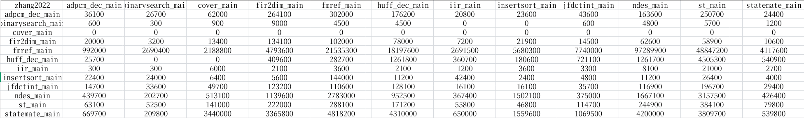
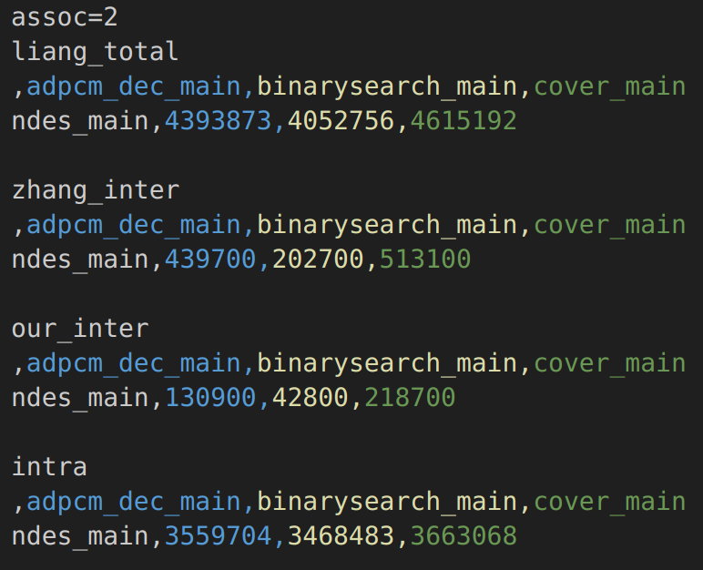
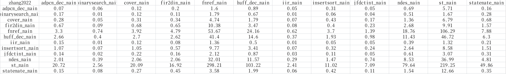

# NewCacheAnalysis

This is a multi-core WCET tool base on [LLVM-TA](https://gitlab.cs.uni-saarland.de/reineke/llvmta) built by University of Saarland  

## Get Started

Please ensure that Docker is installed in the system before proceeding with the following steps for building:

### Build the Docker Image  
This project provides two Docker image build files, based on Arch and Ubuntu 22.04 respectively. Please select according to your needs. The build command is:  
```bash
docker build -t llvmtadocker:latest - < .devcontainer/Dockerfile
```  
Note: To facilitate users in China, the build process will replace the image source. If you need to use your own image source, please modify the content of [Dockerfile](.devcontainer/Dockerfile) accordingly.

### Run the Docker Container  
Execute the following command in the root directory of the project repository:  
```bash
docker run -i -d \
    -v `pwd`:/workspaces/llvmta:rw \
    -v `pwd`/build:/workspaces/llvmta/build:rw \
    --name NCA llvmtadocker:latest
```

### Compile the Project  
Use the following command to enter the container:  
```bash
docker exec -it NCA /bin/bash
```  
> Note: The default user after entering the container is root. To avoid permission issues, it is recommended to switch to an ordinary user for compilation. The container comes with an ordinary user named `vscode`, which can be switched to using the `su vscode` command. Use the `sudo chown -R vscode:vscode /workspaces/llvmta` command to modify the permissions of the project folder.  
> Additionally, you may need to reference some environment variables of the root user, such as `$PATH`, `$LD_LIBRARY_PATH`, etc., to avoid compilation issues.  

Then proceed with the compilation according to the following steps:  
```bash
cd /workspaces/llvmta
./config.sh [dev|rel] # dev is recommended
cd build
ninja -j $(nproc)
```  
Among them, `./config.sh dev` uses Debug mode for compilation, while `./config.sh rel` uses Release mode. Please set according to your needs. The dev mode supports debugging but is expected to occupy 70GB of storage. The number of compilation cores can be selected according to your computer configuration, such as `ninja -j12`. Using all cores may affect the normal use of the computer during compilation, and please pay attention to memory load for multi-core compilation.  


### Run the Experiment

It is recommended that you open the docker in vscode  
```sh  
cd our_experiment
pip install -r requirements.txt
```

#### experiment1: Ratio of Different Parallel Tasks  

In **experiment1**, we evaluate a 12×12 task combination matrix, performing both **intra-core** and **inter-core** analyses for each task.

You can modify the `MAX_THREAD_HYPER` variable on line 114 of `lab1.py` to specify the maximum number of benchmarks to run in parallel. Use the following commands to run both the **Zhang2022** method and our **proposed approach**:

```bash
./lab1.py -s lab1/0516_2c_zw -p -ops options/lab1_l1_82.txt -m zhangw
./lab1.py -s lab1/0516_2c_our -p -ops options/lab1_l1_82.txt -m our
```

After the execution, you can aggregate the results using:

```bash
./post_run.py -s lab1/0516_2c_zw -t lab1/0516_2c_zw -m zhangw
./post_run.py -s lab1/0516_2c_our -t lab1/0516_2c_our -m our
```

The resulting data of **Inter-core analysis** will be saved in `wceet.csv` under the corresponding directories.  

  
     
* Folders ending with `zw` correspond to **Zhang2022's method**, while those ending with `our` correspond to **our proposed approach**.
* **Intra-core analysis** results can be found in `intra_wcet.csv`.

* In each CSV file, **rows represent the analyzed task**, and **columns represent the interfering task**.  
We can obserse from the proposed analysis reduces the inter-core cache latency estimation.  


#### experiment2: Varied Cache Associativity

In **experiment2**, we analyze the task `ndes` under interference from `binarysearch`, `adpcm_dec`, and `cover`, while varying the cache associativity levels (2-way, 4-way, and 8-way).

You can also adjust the `MAX_THREAD_HYPER` variable on line 114 of `lab2.py` as needed.

```bash
./run_lab2.sh # This script internally runs lab2.py
```

After the experiments are completed, use the following scripts to process and summarize the results:

```bash
./post_lab2.sh  
./lab2_summary_0514.py
```

The detailed results for each method and associativity level can be found in the corresponding folders.

* In the folder names, the **second-to-last underscore-separated token** indicates the method used (`ly` for **Liang2012**, `zw` for **Zhang2022**, and `our` for our **proposed method**).
* The **last token** indicates the cache associativity value (e.g., `2`, `4`, or `8`).  

The final aggregated results can be found in `lab2/lab2_summary.csv`.  
   


#### experiment3: Computation Cost

This part evaluate the computation cost of the proposed analysis and Zhang2022. This output value is related to the processor, and the result of each run may also fluctuate up and down to a certain extent.   
> We measured on an AMD EPYC 7763 processor running at 1.50GHz with 503 GB of memory.

The `lab1.py` script will provide the result of computation cost, you can find them in **\*\_runtime.csv** under the corresponding directories. **wceet\_runtime.csv** records the runtime of inter-core analysis for each task combination, and **total\_runtime.csv** shows the overall execution time.  
